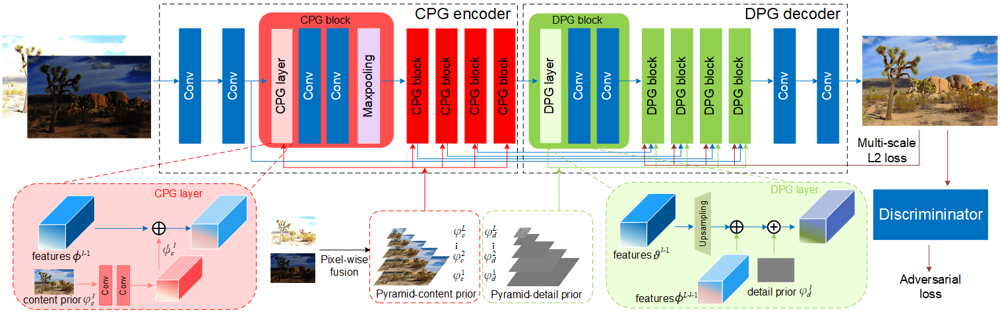

# Deep Prior Guided Network for High-quality Image Fusion
Implementation for robust two-exposure image fusion, ICME 2020 (under review).

## Introduction
In this repository, we provide
* Our model architecture description (Prior Guided Network)
* Demo code
* Trained models
* Fusion examples

## Architecture



Note that the MDSR architecture for the challenge and for the paper[1] is slightly different.
During the challenge, MDSR had variation between two challenge tracks. While we had scale-specific feature extraction modules for track 2:unknown downscaling, we didn't use the scale-specific modules for track 1:bicubic downscaling.

## Test models
1. Clone this github repo. 
```
git clone https://github.com/bigmms/reinforcement_learning_hdr
cd reinforcement_learning_hdr
```
2. Place your own **LDR images** in `./test/Images` folder. (There are several sample images there).
3. Download pretrained models from [Google Drive](https://drive.google.com/drive/folders/1iqkGTl8sqoVEaVFo4uoAJiLFtce_f8cu?usp=sharing). Place the trained model in `./checkpoints`. 
4. Run test. We provide the trained model and you can config in the `agent_test.py`.
```
python agent_test.py
```
5. The results are in `./test/test_run/results` folder.
