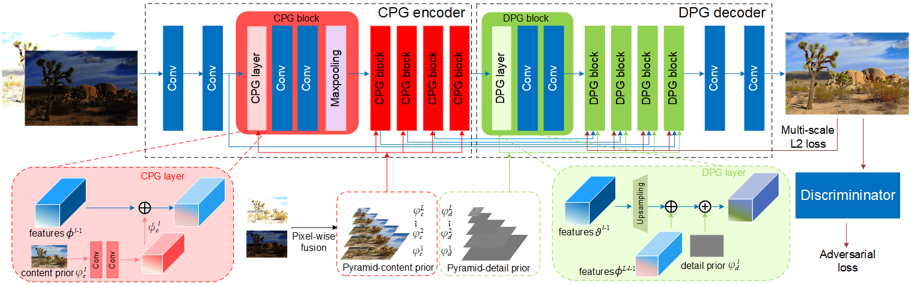

# Deep Prior Guided Network for High-quality Image Fusion
Implementation of deep prior guided network for high-quality image fusion, ICME 2020 (under review).

## Introduction
In this repository, we provide
* Our model architecture description (Prior Guided Network)
* Demo code
* Trained models
* Fusion examples

## Architecture



## Test models
1. Clone this github repo. 
```
git clone https://github.com/bigmms/prior_guided_network_hdr
cd prior_guided_network_hdr
```
2. Place your own **LDR images** in `./HDR` folder. (There are several sample images there).
3. Download pretrained models from [Google Drive](https://drive.google.com/file/d/19lT7K_Ea0qYsEIBI44tS8D76tHUhDoxU/view?usp=sharing). Place the trained model in `./saved_models`. 
4. Run test. We provide the trained model and you can config in the `agent_test.py`.
```
python agent_test.py
```
5. The results are in `./test/test_run/results` folder.

## Results

